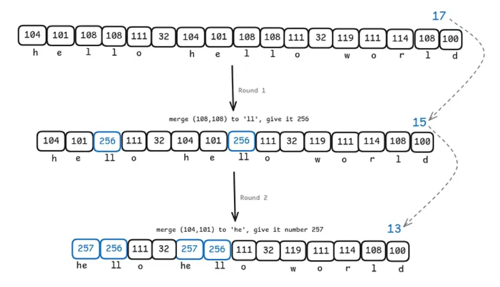

# Byte-Level BPE Tokenizer

A small Python project for learning how LLM tokenizers work. It implements byte-level Byte Pair Encoding (BPE) in the style used by GPT-2 and tiktoken: text is split with a regex, each piece is encoded as UTF-8 bytes, and BPE merges build a subword vocabulary.

This is for learning and experimentation, not a drop-in replacement for production tokenizers like Hugging Face or tiktoken. The goal is to understand the full pipeline from raw text to token IDs.

For a deeper walkthrough of tokenization and Byte Pair Encoding (BPE), see the blog post below. Click the image to read the full article on Medium.

[](https://medium.com/@salisai/tokenization-3488678fd811?sharedUserId=salisai)

## What is implemented

- **Byte-level vocabulary** — 256 base tokens (one per byte). Any UTF-8 text works: English, Arabic, code, emoji, and so on.
- **BPE training** — finds the most frequent byte pairs and merges them until the target vocabulary size is reached.
- **GPT-2-style pre-tokenization** — regex splits text into words, numbers, punctuation, and whitespace before BPE runs on each piece.
- **Encode and decode** — convert text to integer token IDs and back with lossless round-trips.
- **Special tokens** — support for tokens like `<|endoftext|>` used in language model training.
- **Save and load** — trained tokenizers are stored as JSON and can be reused.
- **Learning notebook** — `tokenization.ipynb` walks through the concepts step by step (Karpathy-style).

## Project structure

```
Tokenization/
├── bpe_tokenizer/       # tokenizer library
│   ├── core.py          # BPE training and merge logic
│   ├── patterns.py      # regex pre-tokenization patterns
│   └── tokenizer.py     # BPETokenizer class
├── train.py             # train from text files (CLI)
├── validate.py          # quick round-trip tests
├── tokenization.ipynb   # interactive learning notebook
└── requirements.txt
```

## Requirements

- Python 3.10 or newer

## Setup

```bash
cd Tokenization

python -m venv .venv
source .venv/bin/activate        # Linux / macOS
# .venv\Scripts\activate         # Windows

pip install -r requirements.txt
```

To run only the tokenizer library (without Jupyter), install just `regex`:

```bash
pip install regex
```

## Train a tokenizer

Prepare one or more UTF-8 text files, then run:

```bash
python train.py data.txt -o tokenizer.json -v 8192 --progress
```

Options:

| Flag | Default | Description |
|------|---------|-------------|
| `input` | — | One or more text files to train on |
| `-o`, `--output` | `tokenizer.json` | Where to save the trained tokenizer |
| `-v`, `--vocab-size` | `8192` | Vocabulary size (256 bytes + learned merges) |
| `--pattern` | `gpt2` | Pre-tokenization pattern (`gpt2` or `simple`) |
| `--special` | `<\|endoftext\|>` | Special tokens to add after training |
| `--progress` | off | Print merge progress during training |

Example with multiple files and a larger vocabulary:

```bash
python train.py corpus/part1.txt corpus/part2.txt -o my_tok.json -v 32000 --progress
```

## Use in Python

```python
from bpe_tokenizer import BPETokenizer

# Train
tok = BPETokenizer.train_from_files(
    "data.txt",
    vocab_size=8192,
    special_tokens=["<|endoftext|>"],
    show_progress=True,
)
tok.save("tokenizer.json")

# Load a saved tokenizer
tok = BPETokenizer.load("tokenizer.json")

# Encode text to token IDs
ids = tok.encode("Hello world")

# Decode token IDs back to text
text = tok.decode(ids)

# Encode with special tokens (must be explicitly allowed)
ids = tok.encode("<|endoftext|>Hello", allowed_special={"<|endoftext|>"})
```

## Validate

Run the built-in checks (multilingual text, code, accents, special tokens):

```bash
python validate.py
```

## Learning notebook

Open the notebook for a guided explanation of tokenization, UTF-8 bytes, BPE merges, and regex splitting:

```bash
jupyter notebook tokenization.ipynb
```

The notebook covers the theory. The `bpe_tokenizer` package is the practical, reusable version of the same ideas.

## How it works (short version)

1. **Pre-tokenize** — split input text with a regex so BPE does not merge across word boundaries.
2. **Bytes** — each piece is converted to a list of bytes (0–255).
3. **Train** — count byte pairs across the corpus, merge the most common pair into a new token, repeat.
4. **Encode** — start from bytes, apply learned merges in order (earliest merge first).
5. **Decode** — look up each token ID as bytes, join them, decode as UTF-8.

Because everything starts at the byte level, the same tokenizer handles any language without a separate vocabulary per script.

## Suggested vocabulary sizes

| Use case | Typical size |
|----------|--------------|
| Small experiments | 4,000 – 8,000 |
| Small language models | 16,000 – 32,000 |
| GPT-2 scale | ~50,000 |

A healthy compression ratio on your training data is roughly 3x to 5x (bytes per token). If compression is much higher, merges may be too aggressive for the model to learn useful subword structure.
